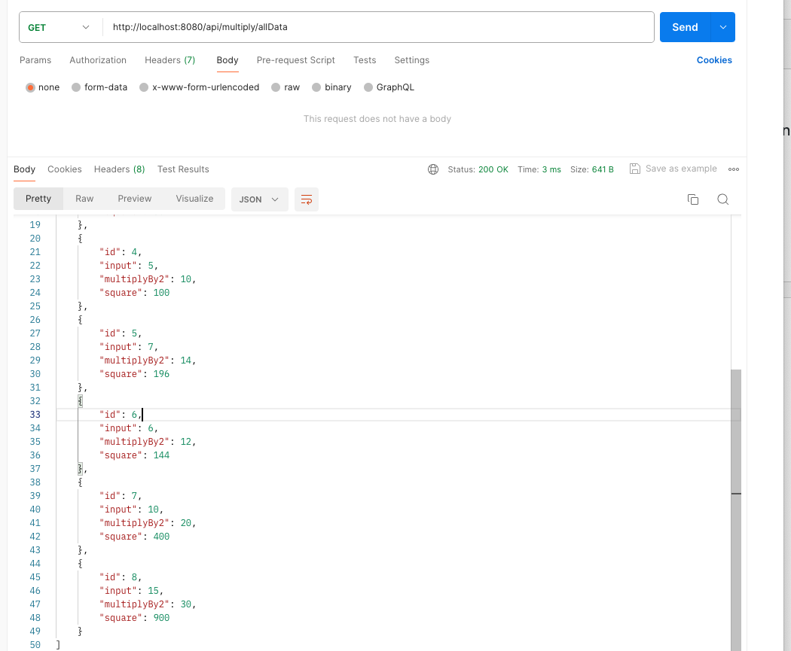

# transcendent_code

### how to run this application

## Frontend 
Open terminal and Run the following command from the root directory
`cd frontend`

`npm install`

Run `ng serve -o`  then  Navigate to `http://localhost:4200/`. The application will automatically reload 

## Backend 
Open terminal and Run the following command from the root directory
`cd backend`

`./mvnw spring-boot:run`

Project Demo

Client View

 
Postman

 

Data from the Database 

